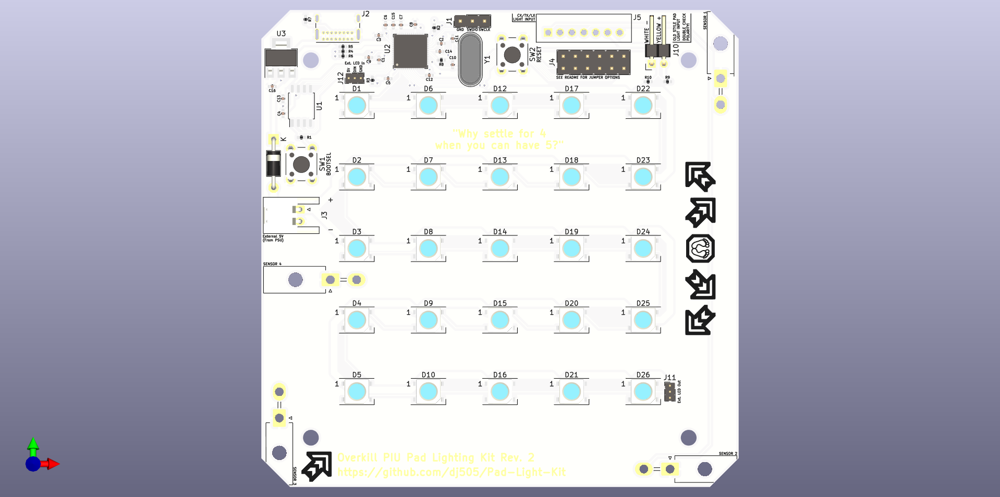

# Overkill PIU Pad Lighting Kit
An upgrade kit, if you consider a 5x5 RGB LED grid in the center of each panel to be an upgrade.  

# What is this?
I wanted to make a drop-in kit that replaced the original LEDs in Pump it Up dance pads with fancy StepManiaX-like RGB lighting. **This is only partially that.** Due to a variety of factors, it's not quite as drop-in as I'd hoped, but installation is still rather straightforward!

There are 2 PCB designs being worked on for this project:
* The main "Panel" PCB
    * Contains all the LEDs, with individual microcontrollers per PCB, ensuring they can all work individually.
    * Fully tested, with updated design/gerber files that hardware issues I initially ran into while prototyping.
* The power distrubution PCB
    * Takes a barrel jack and/or bare wires via screw terminals.
    * 5V input only! Make sure your power supply can pump out enough amps to power all the LEDs.
    * 5 outputs, one per arrow on one pad. In the case of DDR/ITG pads, one may be left unused.
    * Also includes footprints for filtering capacitors, which I haven't found to be necessary. Populate with 10uF 0603 capacitors if needed.

Unlike the PicoFX and my other previous hardware projects, this kit is not meant to be hand-soldered, although hand-solder friendly footprints were used where possible. As this likely will not be sold as a pre-made kit any time soon, be aware that it is not a beginner project. PCB manufacturing and assembly costs are rather affordable, but costs from part sourcing and shipping could add up.

# Compatibility & Overview

### This project is designed to be as easy as possible to install, but does require you to do some amount of manual part sourcing. Please pay close attention to power consumption and make sure you source parts that can support the kit.

This project is made for somewhat modern Pump it Up dance pads (FX through LX), but is plug-and-play compatible with:
* All Pump it Up dance pads **after** SD (SD pads used incandescent bulbs and will require some modification for use with this kit)
* In the Groove pads
* Older Dance Dance Revolution pads that use the same 2.54mm pitch connector (double check first!)
Please **pay close attention to the polarity** of the 12V connector printed on the PCB's silkscreen.  
The **yellow wire should go to 12V.** This may involve plugging the cable in upside down. That's okay. Just keep in mind the pins may need to be bent upwards slightly to accept the connector.

Without some modification to the pads and/or this kit, this project is untested or **NOT** plug-and-play compatible with:
* Pump it Up JUMP pads (unfortunate, I know)
* Modern Dance Dance Revolution pads
* Namco "Crapocab" DDR pads
* StepManiaX pads (for several reasons)
* Dance Master Super Station/3DDX
* EZ2Dancer
If the pads you want to use this project with have a **12V DC** wire that powers the original lights, whether it goes to existing LEDs or to an inverter, **this kit will function, but may require you to cut the wires and/or splice in a new connector.** It likely will also not fit the original mounting holes, in which case you'll need to tape it down or something.

Aside from the individual components required for each PCB, you will need:
* As many "Panel" PCBs as your upgrade requires
    * PIU pads require 5 per full pad, 10 in total for a complete setup
    * ITG/DDR pads require 4 per full pad, 8 in total for a complete setup
* A way to supply 5V with up to ~10A maximum current draw (50W or so)
    * This can be either one 5A power supply **per pad**, or one single super beefy power supply for **both pads simultaneously.**
    * If I did my math right, these metrics are based on the peak power comsumption when every single LED is lit up white at full brightness. **Only run your LEDs on full-brightness white for extended periods of time at your own risk; the kit was not developed with this use in mind.** (It would be bright as heck, though)
* Extra wiring to supply power to the new PCBs
    * I recommend 20AWG, anything thinner is not rated for the possible peak power consumption of one panel
* 2 pin male JST connectors (along with metal connector to be crimped to the wires)
    * These are listed here separately from the female connectors in the bill of materials, as you'll need quite a few.
    * 2 connectors are required per panel. One to connect to the lighting PCB, one to connect to the power distribution board.
* A crimping tool compatible with JST XH connectors (optional, but recommended)

# Main panel PCB
A full BOM can be generated using KiCad's schematic editor. Unlike my previous projects, such as the PicoFX or PicoIO, there are a *lot* of components that you will likely need to source yourself. Many of these have LCSC part numbers attached as an example, but are not guaranteed to be available through JLCPCB's assembly service.  
The following components (some of which are not required) are listed per **single** PCB:

### Bill of materials
|          Component          |          Footprint         |Quantity|
|-----------------------------|----------------------------|--------|
|100nF Capacitor              |SMD 0402                    |10      |
|1uF Capacitor                |SMD 0402                    |2       |
|27pF Capacitor               |SMD 0402                    |2       |
|10uF Capacitor               |SMD 0402                    |2       |
|WS2812B-V5 LED (!)           |PLCC4 5x5mm                 |25      |
|SS34 Diode                   |DO-214AC                    |1       |
|Green LED                    |SMD 0805                    |1       |
|nSMD025 Fuse                 |SMD 1206                    |1       |
|3 Pin Header \*              |2.54mm Pitch                |1       |
|USB Type C Port              |GCT USB4085                 |1       |
|2 Pin JST XH                 |2.50mm Pitch                |1       |
|2x6 Pin Header \*            |2.54mm Pitch                |1       |
|Molex 35312-0760 \~\~        |N/A                         |1       |
|Molex Mini-Fit Jr \~\~       |N/A                         |4       |
|2 Pin Header \~              |2.54mm Pitch, **Horizontal**|1       |
|3 Pin Header \*\*            |1.27mm Pitch, Not Required  |2       |
|10k Ohm Resistor             |SMD 0402                    |1       |
|10K Ohm Resistor \*\*        |SMD 0402 (for SPI flash)    |1       |
|27 Ohm Resistor              |SMD 0402                    |2       |
|5.1k Ohm Resistor            |SMD 0402                    |2       |
|3k Ohm Resistor              |SMD 0402                    |1       |
|1k Ohm Reistor               |SMD 0402                    |3       |
|Tactile Button Switch        |6mm x 6mm                   |2       |
|W25Q32JVSS (or equivalent)   |SOIC-8                      |1       |
|Raspberry Pi RP2040          |QFN-56                      |1       |
|NCP1117 3.3V Output Regulator|SOT-223-3                   |1       |
|12.000MHz Crystal Oscillator |HC49                        |1       |

(!) WS2812B-V5 LEDs don't require external capacitors, so there are no footprints for them on this board. Earlier revisions may not work properly without these capacitors.
\* Optional  
\*\* Do Not Fit (only required if a part malfunctions without it)  
\~ Required for old-style pads (FX and earlier)  
\~\~ Required for new-style pads (CX/TX and newer)  

All **SMD 0402** parts use hand-solder footprints in just in case, however if you do not own a reflow oven or hot air soldering station, please consider using an assembly service available through companies like PCBWay or JLCPCB for a better and more realiable end result. It does cost extra, but will be far less time consuming and far more reliable than soldering hundreds of components by hand.

# Power PCB
This part is extremely basic and just supplies power to the panels. Each PCB should be capable of supplying up to 8A, enough to power all 5 panels. Just make sure to hook it up to a power supply capable of delivering the necessary wattage.

### Bill of materials
|          Component          |          Footprint         |Quantity|
|-----------------------------|----------------------------|--------|
|2 Pin JST XH                 |2.50mm Pitch                |5       |
|10uF Capacitor \*            |SMD 0402                    |5       |
|DC Barrel Jack \*\*          |2.5mm inner, 6.4mm Outer    |1       |
|2 Pin Screw Terminal \*\*    |5mm Plugin Terminal         |1       |

\* Option/not strictly necessary. Serves a purpose, but shouldn't affect functionality if missing.  
\*\* Denotes parts that are interchangeable depending on how you want to power the board

This board lacks mounting holes and is intended to just be attached somewhere near the foot PCB or power supply with double sided tape. Placement is up to you. Footprints for a screw terminal and a DC jack are provided, depending on which is more suited to your use case. You could even solder the power wires straight to the PCB if you really want to.  

JST XH connectors with 20AWG wire will need to be routed from the power distrubution PCB to every individual panel PCB. This shouldn't be all that difficult, just a little extra time consuming. Having a crimping tool would make this far easier.

# Very Important Notes
**(Seriously, you're going to want to double check these!)**

### This kit will require dedicated external power, and there's no safe way around that!
This kit bumps the LED count up to 125 per pad. Stock pads have around 40 or fewer depending on pad model. Please don't try to power this off the cab's original 12V line! The original 22AWG wire is rated for roughly 0.92A. This kit can potentially draw up to 1A per panel, or 5A total per pad. Plus, the 12V line is used for signalling purposes with this kit, and it won't function correctly without it. **I've measured a draw of 0.874A for a single panel lit up white at full brightness, however this may not be consistent from build to build.** While 10A total is a worst-case scenario, be sure to stick to the following guidelines:  
* Make sure you use a power supply that's capable of supplying the necessary amount of power required by this kit, and pick a wire gauge capable of carrying the amount of power needed for each panel. I would recommend 20AWG.  
* You'll need a way to run power into the pads. If I can come up with a more elegant solution I'll be sure to post it in detail, but the holes present in the bottom corners of each arrow are safe bets as entry points for your wires.
* Even if you don't plan on running these at high enough power to draw 5A per pad (or the maximum you have measured on your own), don't skimp out on a power supply. Overdrawing the power supply will cause it to get uncomfortably warm (or worse), and will eventually destroy it. Spend the extra few bucks for safety!

### Make sure you use a bright solder mask!
White is recommended, green and others may also work, but black solder mask isn't known to be very reflective. It won't make a very big difference, but it will definitely look better and brighter.

### If you own a multimeter, check the voltage of the 12V line!
These boards get their "turn on and start animating" signal from the original 12V wiring that's meant to power the stock LEDs/inverters/what have you. To make this safe for the 3.3V RP2040 chip, a voltage divider is used. Until this design is eventually replaced with an optoisolator or other component, **you should do the following:**  
1. Unplug the stock LED
2. Hook up a voltmeter or a multimeter in DC mode to the connector
3. Ensure the connector supples **no less than 10V** and **no more than 13.2V** when supplying power  
If your measurement falls outside of this range and the power supply in your cab isn't adjustable, you may need to use different reistors for the voltage divider circuit.

If the connector is not supplying enough power, the microcontroller won't read it as a "high" signal to start animating the lights. If it's *too* high, you risk damaging the microcontroller. I've haven't seen any machines deviate from this general range before, so chances are you're fine, but make sure to double check. If your machine has a variable voltage power supply **and you know what you're doing**, you can adjust it slightly to fit within the safe range.

# Firmware Setup
This project runs on [CircuitPython for the Raspberry Pi Pico.](https://circuitpython.org/board/raspberry_pi_pico/). I'm not quite clever enough to create a special CircuitPython build specifically for this project yet, maybe one day!

1. Download the .uf2 file for CircuitPython. This project was developed using 7.3.3, but in between writing the firmware and actually receiving all the parts for a kit, 8.0.0 was released as a stable version, so the following instructions have been updated.
2. Plug the board into your PC. The BOOTSEL button shouldn't need to be held as the board should not yet be programmed. If for some reason it already is, use the BOOTSEL button.
3. The board should pop up as a USB mass storage device. Drag and drop the .uf2 file onto it. After a moment, it should disconnect, and you should see a "CIRCUITPY" drive appear in its place.
4. Open the "CIRCUITPY" drive, and copy the contents of this repository's "Firmware" directory onto it, overwriting code.py.
5. Download the [CircuitPython library bundle](https://circuitpython.org/libraries) that matches the version of CircuitPython you installed.
    * Look inside the "lib" directory for an "asyncio" folder. Copy this to the CIRCUITPY drive's "lib" folder.
    * Do the same for "adafruit_pixelbuf.mpy", "adafruit_ticks.mpy", and "neopixel.mpy".
6. Create your animations. See the instructions in /Firmware/README.md or use the included example animations.
    * Your animation should be a bitmap file titled "image.bmp" and located in the "bitmap" directory.
    * By default, there won't be a "bitmap" directory. You'll need to create this by hand or copy over the example one.
7. You're done! If everything is assembled and set up properly, your animations should now work, and the panel is ready to be installed.

# Installation
After assembling and setting up the firmware for each of the panels, actually installing them is the easy part. I'll update this section with photos when I have some.

1. Unplug and remove the original LEDs, and replace them with the new boards.
    * If the mounting holes *do* line up, use the original screws to secure the new boards in place.
    * If the mounting holes *don't* line up, double sided tape will do the trick!
    * You may have to remove some original parts to make room, depending on the pad. This mostly applies to much older pads that have fluorescent lights hooked up to inverters. Carefully remove these (they may be fragile!) and set them aside.
2. Find a power supply, and plan out where the wires are going to go.
    * I find the easiest way to do this is to hide the power supply underneath the dance pad and run the cable coming from the low voltage side in through the one of the 4 holes in the bottom of one of the arrow panels.
    * I would not recommend routing any AC wiring or power supply units inside of the dance pads for safety reasons. It's much safer to run the low voltage DC side in alone.
3. Mount the power distribution PCB.
    * Make sure it's within easy reach of the cable you'll be using to power it.
    * The placement here is entirely up to your discretion, just put it somewhere that allows you to easily run all the necessary wires. I mounted mine under the center panel.
    * This PCB has no mounting holes, since you'll be using double sided tape or other similar adhesive to mount it. Make sure any exposed contacts on the bottom are trimmed down and/or covered and so they do not make contact with the pad frame.
4. Run wires from the distribution board's outputs to each of your panels.
    * If you know what you're doing, and you thoroughly test the power consumption of your components, be sure to use a wire rated for the power draw. Otherwise, I recommend 20AWG wire. I personally measured a 0.874A peak power draw, but your build may differ.
    * You can either try to source wires with JST XH connectors on either end, or you can crimp these yourself.
    * If you crimp these yourself, buy a crimping tool! They don't cost a lot and they make things way way less of a pain. (They're still kind of a pain, though.)
    * Double check that the positive/negative connections line up on both sides of your wires.
5. Fire it up and give it a test!
    * If something doesn't work, move onto the troubleshooting section.

# Troubleshooting
This list will be expanded as potential issues crop up.
* **No lights or pattern on the LED grid**
    1. Make sure the bitmap is in the "bitmap" directory, and is named "bitmap.bmp".
    2. Check that external power is connected. A USB connection will not power the LEDs.
    3. Re-export your bitmap through GIMP with the correct settings:
        * 24-bit colour depth
        * Run-length encoding **disabled**
        * Saving colour space information doesn't seem to make a difference, but if in doubt, disable it
* **Pattern displays, but doesn't look right**
    1. Make sure your spritesheet is made up of exactly 5x5 pixel sprites, all of which should be stacked vertically. More than one column will not work.
    2. Re-export your bitmap through GIMP with the correct settings. See step 3 under "No lights or pattern on the LED grid."
* **All the LEDs past a certain point fail to light up**
    1. Check the solder points on and around the LED where the chain is broken.
        * The strip goes from left to right on the first row, then right to left on the second row, zigzagging back and forth.
        * If any single LED is not properly connected, it can either light up but not send a signal to the next one, or fail to light up itself.
        * Carefully re-solder any bad connections and test again.
    2. Ensure the LEDs are oriented correctly.
        * With the USB port on the top left corner, the notch on every LED should be on the bottom right side.
        * Any LEDs that aren't oriented properly will need to be desoldered and rotated.
* **One single LED doesn't light up, but the rest work**
    1. Add some flux to each leg of the LED and reflow the solder.
        * Screwing the PCB down into the pad may slightly bend it, causing a poor connection on one or more LEDs.
        * Reflowing the solder usually fixes this fault. Current revisions of the PCB with slightly larger mounting holes should be less susceptible to it.

# Credits
Thanks to:
- [sugoku](https://github.com/sugoku) for the Molex 35312 series footprints
